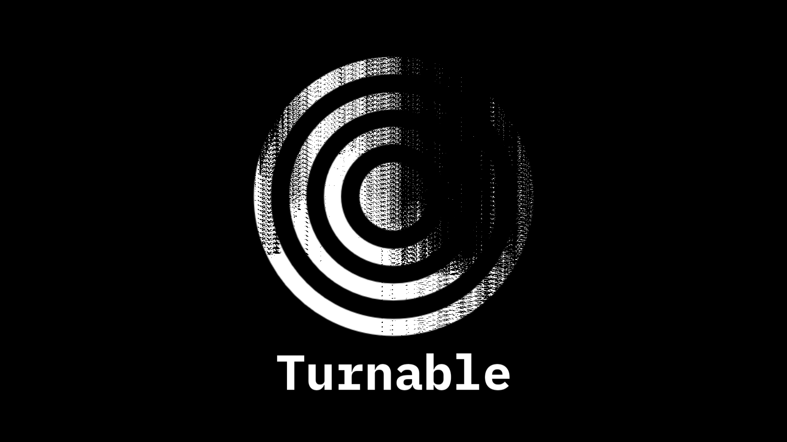

# Turnable

## WARNING: barebones functionality.
## Turnable is a music player...
- That plays raw online audio.
- That is built in compose.
- That is built in kotlin.
- That likes collecting every single audio track.
- That is decentralized and not attached to any music library.
- That supports many formats.
- That will play youtube audio soon.

I hope that this, one day, will free people from centralised streaming services and platforms that each have their own music just because labels are kinda greedy.
